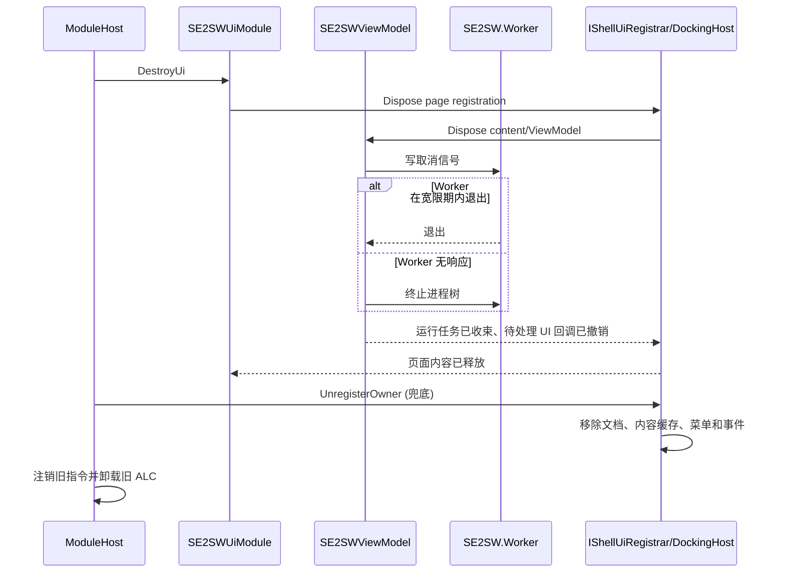

# SE2SW V2.2.0 设计与实施验收：OHS 内嵌工作页

> **V0.7.2 迁移说明（2026-07-27）：** 本文保留 V2.2.0 首次内嵌时的历史设计。AppShell 0.7.2
> 已删除工作页契约，SE2SW 保持版本 2.2.0 和窗口 ID `se2sw`，改为普通工具窗口；转换能力和文件语义不变。
> 显示/隐藏命令改为 `win.show name=se2sw` / `win.hide name=se2sw`，并支持 `win.float`、`win.dock`、
> `win.max` 和 `win.restore`。

> 状态：**已实施、正式部署并完成外界模式实转**  
> 能力基线：V2.0（FeatureWorks 特征识别 + 草图完全定义，已实现并实测）  
> 目标版本：V2.2.0  
> 编写日期：2026-07-27  
> 实施日期：2026-07-27  
> 本文保留实施前问题证据与设计决策，并在第 12 节记录最终实现和验收结果。

---

## 0. 结论摘要

V2.2.0 的目标不是给现有独立窗口换一层样式，而是把 SE2SW 变成 OHS 主窗口中央工作区中的
**单例内嵌页面**。生产环境不再创建标题为“SE2SW 格式转换”的顶层操作系统窗口。

仅把 `SE2SWWindow` 从 `Window` 改成 `UserControl` 无法完成目标。当前 OHS 是前后端双进程结构：

- `OneHistoryStudio.exe` 是具有 `DockingHost` 的 WPF 前端，但配置了 `EnableModules=false`；
- `OneHistoryStudio.Service.exe` 才创建并启动 `ModuleHost`；
- 服务宿主也创建了 WPF `Application` 和 Dispatcher，因此当前 `IUiModule.CreateUi()` 会在服务进程中
  成功创建独立窗口；
- 服务进程没有 OHS 主窗口和停靠宿主，因而不可能把 `UserControl` 嵌入正确位置。

所以 V2.2.0 必须同时完成两层改造：

1. **AppShell/OHS 宿主层**：增加运行时工作页注册能力，并把模块命令能力与模块 UI 能力拆开；
2. **SE2SW 模块层**：把窗口内容提取为 `UserControl`，通过新宿主契约注册，不再自行创建 `Window`。

宿主职责按进程严格分离：

| 进程 | 模块业务指令 | 前端指令代理 | 内嵌 UI | CAD 转换 UI |
|---|---|---|---|---|
| `OneHistoryStudio.exe` | 不加载服务端业务指令 | 执行前端落点 | **允许** | **允许** |
| `OneHistoryStudio.Service.exe` | **允许** | `ExecutionSite.Frontend` 中继 | **禁止** | **禁止** |

`module.manifest.json` 中的 `"ui": true` 只表示“模块声明了 UI 能力”，不能再被解释为“当前进程可以创建
UI”。只有“清单允许”与“宿主能力允许”同时满足时，才加载内嵌 UI。

---

## 1. 版本定位

### 1.1 V2.0 已具备的能力

克劳德提交的 [V2.0 设计与实现记录](05-V2.0-特征识别与草图完全定义.md) 已核对。V2.0 不是待办方案，
而是已经进入 Worker、契约、ViewModel 和界面的能力基线：

- 通过 FeatureWorks 执行 `RecognizeFeatureAutomatic(0x3FF)` 和 `CreateFeatures(...)`；
- 对识别出的 `ProfileFeature` 草图逐个执行 `ISketchManager.FullyDefineSketch(...)`；
- 使用 `ISketch.GetConstrainedStatus()` 验收，不能信任 `FullyDefineSketch` 返回值；
- 界面已有“识别特征”“完全定义草图”选项，以及“特征”“草图”结果列；
- FeatureWorks 缺失或授权不足时可降级保存为哑实体；
- 附着用户已有 SolidWorks 会话时不退出应用、不永久修改用户设置；
- 烧杯样件识别为 1 个旋转特征、草图完全定义 `1/1`，复用用户 SolidWorks 会话连续 5 次成功。

V2.0 的六项实现约束继续有效：预选种子面、识别位固定为 `0x3FF`、显式加载 FeatureWorks、按约束状态
验收、保护用户 SolidWorks 会话、临时启用并恢复英文特征名。V2.2.0 不重写这些 COM 逻辑。

### 1.2 V2.2.0 的职责

V2.2.0 是**宿主集成版本**：改变 SE2SW UI 的承载位置、进程归属、导航方式和热重载生命周期，保留 V2.0
的转换能力与交互语义。

V2.2.0 的模块程序集、`ModuleInfo.Version` 与模块清单已经统一为 `2.2.0`。版本提升只改变宿主集成；
Worker JSON 协议和 V2.0 CAD 转换语义保持兼容。

---

## 2. 实施前状态与问题证据

### 2.1 实施前 SE2SW 是独立窗口

当前调用链如下：

```text
ModuleHost
  -> IUiModule.CreateUi()
  -> SE2SWUiModule.CreateUi()
  -> SE2SWWindowHost.Create()
  -> new SE2SWWindow()
  -> Window.Show()
```

对应文件：

| 文件 | 当前行为 |
|---|---|
| `src/SE2SW/SE2SWUiModule.cs` | 实现旧 `IUiModule`，转调静态窗口宿主 |
| `src/SE2SW/SE2SWWindowHost.cs` | 持有静态 `SE2SWWindow`，负责创建、显示、隐藏和关闭 |
| `src/SE2SW/SE2SWWindow.xaml` | 根元素为 `Window`，固定 `1080 x 720` |
| `src/SE2SW/SE2SWCommands.cs` | `se2sw.show/hide` 直接操作独立窗口 |

这套结构绕过 OHS 页面导航、布局持久化和模块所有权管理。窗口即使由模块热重载关闭，也不属于 OHS
中央工作区，用户会看到两个并列的应用窗口。

### 2.2 OHS 当前停靠接口不能动态注册模块页

现有 `IUiModule` 只有无参数的 `CreateUi()` / `DestroyUi()`，模块拿不到 OHS 页面宿主。

现有 `IDockingService` 只能操作已注册的窗口：`Show`、`Hide`、`Float`、`Dock`、布局保存/恢复等；没有
运行时 `Register` / `Unregister`。`ToolWindowDescriptor` 在 `ShellConfig.ToolWindows` 中静态装配，
`DockingHost` 构造时固定收集，内容模型是 AvalonDock `LayoutAnchorable`。

SE2SW 是一个包含模式、路径、批量表格、进度和结果的高密度工作面，不适合塞进狭窄侧边工具窗。
它应使用中央 `LayoutDocument` 语义。当前中央区只有固定的 `__main__` 文档，因此需要单独的“工作页”模型，
不能复用 `ToolWindowDescriptor` 后再靠比例补救。

### 2.3 当前进程归属是 P0 缺陷

OHS 前端在 `b-Code-Studio/App.xaml.cs` 中设置：

```text
EnableModules = false
EnableRemoteManagementViews = true
```

后台服务则在 `StudioServiceCompositionFactory` 中创建 `ModuleHost`，`ServiceHost` 又创建 WPF
`Application`、设置 UI Dispatcher，并调用 `Modules.Start()`。当前 `ModuleHost` 只检查模块槽的
`"ui": true`，随后就实例化 `IUiModule` 并调用 `CreateUi()`。

V1.1 部署时，独立 SE2SW 窗口实际由 `OneHistoryStudio.Service.exe` 创建，已经证明该路径会发生。V2.2.0
必须从宿主能力层阻断它，而不能依赖“服务通常没有桌面”这种环境假设。

### 2.4 为什么不能只改成 `UserControl`

如果只替换 XAML 根元素：

1. 服务进程仍会调用 UI 生命周期；
2. 服务进程没有 `DockingHost`，页面无处注册；
3. OHS 前端没有加载该模块，也拿不到页面类型；
4. `se2sw.show/hide` 仍先被前端总线转发到服务端；
5. 热重载时即使移除视觉元素，`DockingHost` 内容缓存、事件订阅或运行中的 `StartAsync` 仍可能固定模块 ALC。

因此“UI 宿主分流、动态工作页契约、前端命令落点、异步清理”是同一个交付项，不能拆成互不相干的补丁。

---

## 3. 目标与非目标

### 3.1 目标

1. SE2SW 作为 OHS 中央工作区的单例页面显示，不创建生产用顶层窗口。
2. 页面只在 `OneHistoryStudio.exe` 中创建；服务进程绝不实例化 SE2SW View/ViewModel。
3. 模块能在运行时注册、显示、隐藏、激活和注销工作页。
4. 页面控制统一使用 OHS 内置 `page.list/open/close/activate`；`se2sw.show/hide` 仅保留为旧命令兼容提示，
   不再维护第二套页面控制链路。
5. 模块热重载前取消并收束转换任务，移除页面和内容缓存，允许旧 ALC 回收。
6. V2.0 的两个识别选项、两个结果列、告警颜色、降级信息和转换行为全部保留。
7. OHS 兼容模式与外界模式的目录语义不变。
8. AppShell Core 层继续不引用 WPF/AvalonDock；模块也不直接引用 AvalonDock。

### 3.2 非目标

- 不改变 `.par -> .x_t -> .SLDPRT` 主链路。
- 不改写 Solid Edge/SolidWorks COM 实现，不扩大到 `.asm`、`.psm`、`.dft`。
- 不在 V2.2.0 引入多实例 SE2SW 页面。
- 不把批量转换开放给 MCP；`mcpExposure=hidden` 继续有效。
- 不承诺在这一版解决 V2.0 遗留的几何校验、无授权机器验证或 FeatureWorks 硬超时问题。
- 不把独立窗口作为旧 OHS 的自动回退方案；宿主版本不兼容时应明确拒绝加载 UI。

---

## 4. 架构决策

### 4.1 使用中央工作页，不使用侧边工具窗

新增 `WorkPageDescriptor`，映射为 AvalonDock `LayoutDocument`。工具窗和工作页保持两个明确模型：

| 语义 | 工具窗 | 工作页 |
|---|---|---|
| 典型内容 | 控制台、资源树、属性、命令详情 | SE2SW 批处理、编辑器、设计器 |
| AvalonDock 模型 | `LayoutAnchorable` | `LayoutDocument` |
| 默认区域 | 上下左右或标签组 | 中央文档区 |
| 关闭行为 | 隐藏 | 可关闭页销毁；SE2SW 以 `CanClose=false` 注册为常驻页 |
| 浮动 | 可选 | V2.2.0 对模块页禁用 |

SE2SW 使用权威稳定页面 ID `se2sw`，标题为“SE2SW 格式转换”，`IsSingleton=true`。
首次安装且无布局记录时默认显示；用户隐藏后，普通启动与热重载都尊重已保存状态，不强制抢焦点。

### 4.2 最终模块 UI 宿主契约

AppShell 0.7.0/0.7.1 最终采用以下不依赖 WPF 的最小契约：

```csharp
public sealed class WorkPageDescriptor
{
    public required string Id { get; init; }
    public required string Title { get; init; }
    public required Func<object> ContentFactory { get; init; }
    public bool CanClose { get; init; } = true;
}

public interface IShellUiRegistrar
{
    IDisposable OpenWorkPage(WorkPageDescriptor page, string owner);
    void CloseWorkPage(string id);
    bool ActivateWorkPage(string id);
    void UnregisterOwner(string owner);
}

public interface IUiModule
{
    void CreateUi();
    void DestroyUi();
}

public interface IShellUiAware
{
    IShellUiRegistrar ShellUi { set; }
}
```

关键语义：

- `ModuleHost` 在 `CreateUi()` 前注入 `IShellUiRegistrar`，模块不引用 AvalonDock；
- `OpenWorkPage` 返回的句柄负责精确注销；`ModuleHost` 无论模块是否主动释放，都会再按 owner 调用
  `UnregisterOwner` 兜底；
- `ContentFactory` 返回 `object` 以保持 Core 无 WPF 依赖，Shell 实现负责校验其为 `FrameworkElement`；
- 页面 ID 在进程内唯一，重复注册必须报错，禁止静默覆盖；
- 注销必须同时移除布局节点、内容缓存、菜单项、事件订阅和 owner 映射。

SE2SW V2.2.0 实现 `IUiModule` 和 `IShellUiAware`；无窗服务宿主设置 `EnableUiModules=false`，因此不会
实例化其 View/ViewModel。

### 4.3 把模块命令能力和模块 UI 能力拆开

当前单一 `EnableModules` 不足以描述 OHS 双进程。建议把模块宿主能力显式拆分，至少包含：

| 能力 | OHS 前端 | OHS 服务 |
|---|---:|---:|
| 扫描模块槽与监听 UI 变更 | 是 | 是 |
| 注册服务端业务指令 | 否 | 是 |
| 注册/执行前端专用指令 | 是 | 仅注册中继描述符 |
| 创建 `IUiModule` 并注入 `IShellUiRegistrar` | 是 | **否** |
| 执行 `IDeferredStartupWork` | 否 | 是 |

可以用 `ModuleHostOptions`、能力位或拆分的 `ModuleUiHost` 实现，但最终必须能从组合根清楚读出：

```text
OneHistoryStudio.exe          EnableUiModules = true
OneHistoryStudio.Service.exe  EnableUiModules = false
```

`"ui": true` 是第一道模块声明闸门，`EnableUiModules` 是第二道宿主授权闸门。缺少任意一项都不得
实例化或调用 `IUiModule`，而不仅仅是“不显示”。

### 4.4 页面指令的最终语义

页面导航由 AppShell/OHS 内置前端命令统一承担：`page.list` 查询，`page.open id=se2sw` 打开或激活，
`page.activate id=se2sw` 只激活。SE2SW 以 `CanClose=false` 注册，故 `page.close id=se2sw` 会明确拒绝。

`se2sw.show` 返回“请在 OHS 前端执行 `page.open id=se2sw`”，`se2sw.hide` 返回常驻页不支持隐藏的说明。
二者仅为旧调用方提供迁移提示，不直接持有页面句柄，也不形成服务到前端的专用中继。任何失败分支都禁止
回退创建独立 `Window`。

---

## 5. SE2SW 页面改造

### 5.1 视图拆分

生产视图改为：

```text
SE2SWUiModule : IUiModule, IShellUiAware
  -> IShellUiRegistrar.OpenWorkPage(...)
  -> SE2SWView : UserControl
  -> SE2SWViewModel
  -> WorkerClient
  -> SE2SW.Worker.exe
```

建议将 `SE2SWWindow.xaml` / `.xaml.cs` 重命名并改造为 `SE2SWView.xaml` / `.xaml.cs`。根元素不再设置
窗口标题、固定宽高、屏幕居中或窗口背景；尺寸由 OHS 文档区决定。文件夹对话框的 owner 使用
`Window.GetWindow(this)` 取得 OHS 主窗口，不再把 `this` 当作独立 `Window`。

### 5.2 页面布局

保留现有工作流，但适配 OHS 文档区：

1. 顶部紧凑工具栏：OHS 兼容/外界模式、路径、选择文件夹、已选择数量；
2. OHS 模式目录摘要：SE、GE、SW 三个解析路径；
3. 批处理工具行：重新扫描、全选、清空选择、识别选项、模式对应的主转换按钮；
4. 中央可伸缩结果表：源文件、XT、SolidWorks、状态、特征、草图、结果；
5. 底部状态与进度区：批次摘要、进度条、取消。

OHS 已提供文档标签标题，页面内不再保留模拟窗口标题栏的 58px 深色横条；`SE2SW` 标识和选择摘要可并入
紧凑工具栏。页面不能依赖 `1080 x 720`，在 OHS 中央区缩小时表格应优先滚动，按钮文字不得被裁切。

### 5.3 V2.0 控件保留

内嵌化不能回退下列 V2.0 功能：

- “识别特征”默认勾选；
- “完全定义草图”依赖前一项；
- 结果表保留“特征”和“草图”列；
- `SketchFullyDefined < SketchTotal` 或识别降级时保留警示色；
- FeatureWorks 不可用时显示明确降级原因；
- 批次开始、进度回传和完成结果仍由现有契约驱动。

UI 内嵌化只改变承载方式，不改变 `BatchRequest`、`FeatureOutcome` 和 Worker JSON 协议。

### 5.4 命令与页面控制器

`SE2SWCommands` 不再调用 `SE2SWWindowHost`，也不持有页面 registration。最终控制面如下：

| 命令 | V2.2.0 行为 | 不允许的行为 |
|---|---|---|
| `page.open id=se2sw` | 由 OHS 前端显示并激活唯一 `se2sw` 页 | 创建新窗口或第二个页面 |
| `page.activate id=se2sw` | 只激活已注册页面 | 隐式创建另一页面 |
| `page.close id=se2sw` | 因 `CanClose=false` 明确拒绝 | 销毁常驻页或 Worker 中途状态 |
| `se2sw.show/hide` | 返回迁移说明文本 | 直接操作 UI 或在服务进程访问 WPF |

页面 registration 只由 `SE2SWUiModule` 持有，并在 `DestroyUi()` 中释放。服务进程不实例化 UI 模块，
不能尝试访问 `Application.Current`。

---

## 6. 生命周期与热重载

### 6.1 正常加载

1. 前端模块 UI 宿主发现 `module.manifest.json` 的 `ui=true`。
2. 宿主建立带模块名、槽名、加载代次的 owner scope。
3. 在 OHS UI 线程实例化 `SE2SWUiModule`，注入 `IShellUiRegistrar` 并调用 `CreateUi()`。
4. 模块以 `CanClose=false` 注册 `se2sw` 描述符；Shell 创建对应 `LayoutDocument`。
5. 首次显示时由内容工厂创建 `SE2SWViewModel` 与 `SE2SWView`。
6. 菜单或 `page.open id=se2sw` 只激活现有单例页面。

### 6.2 常驻页关闭语义

SE2SW 是 `CanClose=false` 常驻工作页，标签不提供关闭入口，`page.close` 也会拒绝。`page.open` 与
`page.activate` 只激活同一 View/ViewModel。应用退出或模块热重载才进入真正销毁流程。

### 6.3 热重载顺序



最终实现由 `SE2SWViewModel` 跟踪唯一活动运行任务。`Dispose()` 先禁止新启动和新进度入队，撤销 Dispatcher
中尚未执行的回调，再取消批次并同步等待 `StartAsync`/`WorkerClient` 收束；CTS 只由运行任务的 `finally`
释放，取消与摘除受同一生命周期锁保护。Worker 续体不依赖 UI 线程，因此从 UI 线程热重载不会形成互等死锁。

建议总关闭宽限期为 20 秒：先走 Worker 现有取消文件和 15 秒优雅期，再强制终止由本批次启动的 Worker
进程树。CAD 用户会话保护规则仍由 Worker 执行，不能从前端直接杀 `Edge.exe` 或 `SLDWORKS.exe`。

### 6.4 布局持久化

动态页面注册需要扩展布局恢复规则：

- 已注册页面按稳定 `ContentId` 重新绑定新的内容工厂；
- 页面暂时未注册时保留其可见性/位置元数据，但不得反序列化旧内容对象；
- 模块重新注册同一 ID 后恢复上次可见状态；
- 模块永久移除时，未知页面记录可在布局下一次保存时清理；
- 任何布局缓存都不得持有来自已卸载 ALC 的 View、ViewModel、委托或类型对象。

---

## 7. 实际改动清单

以下项目均已实施；类名以最终代码为准。

### 7.1 AppShell / OHS

| 位置 | 实际改动 |
|---|---|
| `AppShell.Core/Modules` | 新增 `IShellUiRegistrar`、`IShellUiAware`，沿用 `IUiModule` 生命周期 |
| `AppShell.Core/Docking` | 新增 `WorkPageDescriptor` 与页面信息模型 |
| `AppShell.Services/Modules/ModuleHost.cs` | 拆分命令/UI 能力；注入注册器；销毁后按 owner 兜底回收 |
| `AppShell.Shell/Docking/DockingHost.cs` | 支持运行时注册/注销 `LayoutDocument`、单例激活、内容缓存清理和布局恢复 |
| `AppShell.Shell/ShellConfig.cs` | 增加 `EnableUiModules`，不与服务端模块命令开关绑定 |
| `AppShell.Shell/ShellWindow.xaml.cs` | 把 `ShellUiRegistrar` 注入前端模块加载器 |
| `b-Code-Studio/App.xaml.cs` | 前端启用模块内嵌 UI，但继续不承载服务端业务命令 |
| `StudioServiceCompositionFactory.cs` | 显式禁用模块 UI，保留业务指令和前端代理描述符 |
| `BuiltinCommands` | 新增通用 `page.list/open/close/activate` 前端页面命令 |

### 7.2 SE2SW

| 位置 | 实际改动 |
|---|---|
| `src/SE2SW/SE2SWWindow.xaml(.cs)` | 改为 `SE2SWView : UserControl`，去除窗口属性与重复标题栏 |
| `src/SE2SW/SE2SWUiModule.cs` | 实现 `IUiModule`/`IShellUiAware`，通过注册器打开工作页 |
| `src/SE2SW/SE2SWWindowHost.cs` | 删除生产窗口宿主，不保留第二套页面控制器 |
| `src/SE2SW/SE2SWCommands.cs` | `show/hide` 仅返回迁移说明，实际页面控制统一使用 `page.*` |
| `src/SE2SW/SE2SWViewModel.cs` | 跟踪活动任务、撤销待处理 UI 回调、取消并等待 Worker 后再释放 |
| `tests/SE2SW.UiSmoke` | 改为测试宿主承载 `UserControl`；如保留 Window，只能存在于测试工程 |
| `z-SE2SW/module.manifest.json` | 实现验收后统一更新版本；继续声明 `ui=true` 和 `mcpExposure=hidden` |

独立窗口测试壳如果保留，必须放在 `tests/SE2SW.UiSmoke`，且不能随 OHS 模块槽部署。生产 DLL 中不得存在
“宿主不支持时自动 `new SE2SWWindow()`”的回退路径。

---

## 8. 兼容与迁移策略

1. AppShell 沿用 `IUiModule`，新增 `IShellUiAware` 注入内嵌界面注册器；服务宿主设置
   `EnableUiModules=false`，无条件禁止创建模块 UI。
2. SE2SW 只实现这一套 UI 生命周期，不保留独立窗口回退，避免一次加载创建两份界面。
3. 老版本 OHS 不具备 `IShellUiRegistrar` 时，SE2SW 业务指令可以按兼容策略继续被扫描，但 UI 标记为“不兼容的
   OHS 宿主版本”；不能打开独立窗口。
4. 模块清单 `ui=true` 保持不变；它仍是声明能力和部署审计依据。
5. 页面 ID 一旦发布不得随意改名，否则会产生孤立布局记录。
6. V2.0 Worker 和 Contracts 在没有协议变化时保持二进制输出结构不变，降低本次宿主改造的回归面。

AppShell/OHS 宿主契约与 SE2SW 模块必须作为同一发布批次部署。只部署其中一侧不算 V2.2.0 成功。

---

## 9. 验收门槛

### 9.1 P0 发布门槛

| 编号 | 验收项 | 通过条件 |
|---|---|---|
| P0-01 | 无生产独立窗口 | OHS 运行期间不存在 SE2SW 顶层 OS 窗口 |
| P0-02 | 正确进程归属 | SE2SW View/ViewModel 只存在于 `OneHistoryStudio.exe` |
| P0-03 | 服务 UI 隔离 | `OneHistoryStudio.Service.exe` 从未实例化 SE2SW `IUiModule` 或 View/ViewModel |
| P0-04 | 单例 | 连续激活页面仍只有一个 `se2sw` |
| P0-05 | 页面命令 | `page.list/open/activate` 正确操作唯一 `se2sw` 页；`page.close` 因常驻策略拒绝；旧 `se2sw.show/hide` 只返回迁移说明 |
| P0-06 | 热重载清理 | 空闲坏模块 10 次热重载无泄漏；活动转换 Dispose Smoke 证明取消后等待 Worker、撤销待处理回调并禁止再次启动 |
| P0-07 | 布局恢复 | 隐藏/显示状态在重启与热重载后按设计恢复，布局文件损坏仍能回退默认布局 |
| P0-08 | V2.0 功能回归 | 识别选项、草图选项、特征数和草图比例完整显示并正确回填 |
| P0-09 | 外界模式实转 | 临时样件完成 `.par -> .x_t -> .SLDPRT`，源哈希不变，产物可重新打开 |
| P0-10 | OHS 模式回归 | 目录定位和从 `Unused` 移动 GE/SW 的既有规则不变 |

### 9.2 自动化与诊断要求

- AppShell 增加伪模块测试：服务能力关闭 UI 时，`Attach/CreateUi` 调用次数必须为 0；
- 动态页面测试覆盖注册、重复 ID、显示、隐藏、注销、重注册和布局反序列化；
- 注销后用弱引用验证 View、ViewModel、内容工厂委托和旧 ALC 可回收；
- UI Smoke 枚举 `Application.Current.Windows`，生产宿主下不得出现 SE2SW `Window`；
- 日志必须包含模块名、槽名、加载代次、页面 ID 和 UI 宿主进程名，便于定位错进程加载；
- 服务端收到前端命令但没有前端连接时返回结构化失败，不得超时等待或创建隐藏窗口。

---

## 10. 风险与待确认项

| # | 风险 | 影响 | 处理要求 |
|---|---|---|---|
| R1 | 前端与服务各自监听同一模块槽 | 重载时序不同，短暂版本不一致 | 以部署完成标记/稳定防抖后加载；日志记录加载代次 |
| R2 | 动态 `LayoutDocument` 仍被 `_contents` 或布局事件持有 | 旧 ALC 无法卸载 | owner scope 统一清缓存并做弱引用回收测试 |
| R3 | XAML 合并全局 `ResourceDictionary` | Shell 资源可能固定模块类型 | 页面资源保持局部；注销时不把模块资源留在 `Application.Resources` |
| R4 | 活动转换销毁时旧续体继续运行 | 旧 ALC 无法回收 | 已跟踪活动任务、撤销 UI 队列并等待 Worker 收束；逻辑 Smoke 覆盖 |
| R5 | 为模块另造页面命令形成双控制面 | 页面语义漂移或中继循环 | 统一使用 AppShell `page.*`；`se2sw.show/hide` 仅返回迁移说明 |
| R6 | 热重载时用户正在使用共享 SolidWorks 会话 | 强制终止可能伤及用户会话 | 只终止 SE2SW.Worker；CAD 会话仍遵守 V2.0 所有权规则 |
| R7 | 首次注册默认显示会抢占中央工作区 | 影响首次使用布局 | 仅无既有布局记录时显示；之后尊重用户隐藏状态 |
| R8 | V2.0 的硬超时字段尚未真正生效 | FeatureWorks 卡死时卸载变慢 | 作为已知遗留单独跟踪，不用 UI 内嵌改造掩盖 |

实施时对两项产品级选择作出如下裁决：

1. OHS 菜单入口放在“视图”还是“工具”；无论选择哪处，底层都调用同一个页面 registration。
2. 是否在模块管理页增加“打开界面”动作；若增加，也只调用 `se2sw.show`，不建立第二套导航逻辑。

---

## 11. 实际实施顺序

本次按以下顺序完成：

1. 先在 AppShell Core 定义工作页、owner scope、异步 UI 生命周期和前端命令元数据。
2. 为 `DockingHost` 实现动态 `LayoutDocument` 注册/注销及布局持久化，并先通过伪页面测试。
3. 拆分 OHS 前端/服务的模块宿主能力，先证明服务不会再创建任何模块 UI。
4. 跑通一个最小测试模块的前端命令中继、页面显示/隐藏和热重载。
5. 再把 SE2SW `Window` 提取为 `UserControl`，接入 registration 和异步释放。
6. 回归 V2.0 UI 与 Worker，再执行外界模式真实样件转换。
7. 最后回归 OHS 兼容模式、更新版本元数据、生成部署包并写实施验收记录。

前四步通过后才删除原生产窗口宿主；最终生产部署物不存在独立窗口回退路径，内嵌失败会明确记录为模块
UI 加载失败，不会在服务进程中悄悄创建窗口。

---

## 12. 实施与验收记录

### 12.1 最终实现

- AppShell 0.7.0 新增 `IShellUiRegistrar` / `IShellUiAware`、动态工具窗、中央工作页、owner 回收与
  `page.list/open/close/activate`；0.7.1 增加 `win.max/win.restore`、双击标签最大化和布局载入保页。
- OHS 2.7.0 的前端加载模块 UI，服务端只注册模块业务命令。服务进程没有 UI 注册器，不实例化
  SE2SW View/ViewModel。
- SE2SW 根视图已改为 `SE2SWView : UserControl`，由 `SE2SWUiModule` 通过页面 ID `se2sw` 注册为
  `CanClose=false` 的常驻中央工作页。生产 `SE2SWWindowHost` 与 `SE2SWWindow` 已删除。
- 生产源码中不存在 `new Window()`、静态窗口字段或 `Application.Current.Dispatcher`；V2.0 的
  FeatureWorks、草图完全定义、结果列、OHS/外界模式和 Worker 转换链保持不变。

### 12.2 自动化结果

- AppShell Debug/Release：0 警告、0 错误；0.7.1 四包及符号包 staging 完成，漏洞项 0，
  `PackageSmoke: PASS`，演示 EXE FileVersion=`0.7.1.0`。
- OHS Debug/Release：0 警告、0 错误；原七套 Smoke 与新增 DockingSuite 在两配置全部通过。
- DockingSuite 覆盖动态注册/注销、三工作页、布局保存/载入、最大化/恢复、内容不重建、无布局命令
  风暴和 owner 清理。
- 故意不主动注销窗口的坏模块连续热重载 10 次：无窗口重影，旧 ALC 弱引用全部回落，DLL 可删除。
- SE2SW Debug/Release 与 UI Smoke 构建 0 警告、0 错误；逻辑 Smoke 两配置均通过。新增活动转换销毁用例使用
  可控假 Worker，验证取消信号、Dispose 等待、`StartAsync` 完成、销毁后禁止重启，以及排队进度不再回写。

### 12.3 正式部署与页面验收

- OHS 2.7.0 已部署至 `C:\OneHistory\OneHistory-Push\OneHistoryStudio`；旧 2.6.0 整目录回退包为
  `OneHistoryStudio-rollback-2.6.0-20260727-201817`。SE2SW 2.2.0 槽的 8 个文件与 Release 源逐一
  SHA-256 相等，旧槽回退至 `%AppData%\OneHistoryStudio\ModuleBackups\SE2SW-rollback-20260727-201837`。
- 部署日志确认 `se2sw 2.2.0` 装载。正式 MCP `initialize` 返回 OHS 2.7.0；`page.list` 仅列出一个
  活动页 `se2sw`，`page.open id=se2sw`、`win.max name=se2sw`、`win.restore` 均成功。
- 生命周期补丁重新部署后，槽内 `SE2SW.dll` 与 Release 的 SHA-256 均为
  `C42DFF2E3395B8DC3AC35BBDC0FE697E8B85D6D7C688378FE3C9B021537385BB`；旧 DLL 回退副本位于
  `%AppData%\OneHistoryStudio\ModuleBackups\SE2SW-lifecycle-prepatch-20260727-205128`。
- 重启后的正式 MCP 再次确认 `page.open`、`page.activate` 成功；`page.close` 返回“常驻页，不能关闭”且
  `page.list` 仍只有一个活动 `se2sw`；`win.max/restore` 成功。本次启动除主动关闭拒绝产生的预期错误记录外，
  无其他 Warn/Error。
- 最终 DLL 在正式 OHS 运行态原位覆盖触发空闲热重载：21:00:20 检测变化、21:00:21 完成装载；前后端
  进程保持运行，重载后 `page.list` 仍只有一个活动 `se2sw`，无 Warn/Error。
- Windows 顶层窗口枚举只有 `OneHistoryStudio v2.7.0`，没有独立 SE2SW 窗口。Windows 图形捕获接口
  对该 WPF 窗口返回 `0x80004002`，因此本轮没有留 GUI 截图；双击手势由 DockingSuite 覆盖，现场以
  同状态机的 `win.max/restore` 完成实跑。

### 12.4 外界模式真实转换

测试目录：`C:\Users\Administrator\Desktop\临时测试`。请求使用已部署槽内的
`SE2SW.Worker.exe`，`mode=1`、`overwrite=false`、FeatureWorks 与草图完全定义均开启。

| 项目 | 结果 |
|---|---|
| 输入 | `电磁铁.par`，190,976 字节 |
| 源 SHA-256 | `502F9313AD1B806D63A7A0BC2E54AF55BFB81F946DA79828F1A09AB8FEEE4145`，复制前后相同 |
| XT | `电磁铁.x_t`，7,303 字节，`FORMAT=text`，SHA-256 `F26BD51FF816ACC81992F518564B00E11ABFA1CDA3462E155290D43B3432A2C1` |
| SLDPRT | `电磁铁.SLDPRT`，56,428 字节，SHA-256 `6123FCAA5056BFD6F02E6256D5FA1EBC0B60858399310BCCDA1AAFC614526FAC` |
| Worker | 退出码 0；保存 native error=0、warning=0 |
| FeatureWorks | `RecognizeFeatureAutomatic` 返回 0，按设计降级为导入实体，不阻断保存 |
| 复开 | SolidWorks `OpenDoc6` errors=0、warnings=32，特征树含 `Imported1 [BaseBody]` |
| 清理 | 测试后 Edge、SLDWORKS、SE2SW.Worker 进程均为 0 |

首次使用 `零件.par` 时 Solid Edge `SaveBody` 返回 `E_ABORT (0x80004004)`，Worker 退出码 1，未生成
XT 或 SLDPRT，也未留下临时产物。随后换用 `电磁铁.par` 完成上述全链路。必要事实已汇总到
[07-V2.2.0-生命周期部署与外界模式实测](07-V2.2.0-生命周期部署与外界模式实测.md)；含本机绝对路径的请求
JSON、事件 JSONL 和空错误日志已删除，不进入 OHS 仓库。此次失败说明单一样件成功不等价于所有历史
Solid Edge 文件均兼容，后续批量验收仍需逐类样件覆盖。
